# educated-basic-cpp

- 소스 : https://github.com/codenuri/CPP1

# 2. namespace
- 관련된 요소를 묶어서 관리가 편하다.
- 이름 충돌을 막을수 있다.

## namespace에 있는 요소 접근하는 3가지 방법
1. qualified name을 이용 -> Audio::init();
1. using 선언을 사용하는 방법 -> using Audio::init;
1. using 지시어 -> using namespace Audio;

- using 선언 및 지시어는 함수 안에 바깥에 놓을수 있다 .
- 가능하면 qualified name 을 이용하는게 가장좋다.
- ::init() 을 하면 무조건 global에 있는 것을 쓰면 된다. 

## 함수를 선언 파일과 구현 파일로 분리 할때
1. 함수의 선언부와 구현부를 모두 namespace로 묶어야 한다.  namespace Audio {  ....  ... }
1. 구현부를 만드는 2가지 방법 : 대부분 1번 방법을 사용하는게 가장 좋다. 

## namespace std
- count는 std에 도 있다.  이름 충돌이 나올수 있다. 
- ```cpp
    int count=0;
    ::count
  ```

## C++ 표준 헤더 파일 
- 헤더 파일의 확장자를 사용하지 않는다.
- <cstdio> 은 <stdio.h> 에서 뒤의 확장자 없애고 앞에 c를 붙이면 된다.

### <stdio.h> vs <cstdio>
- C++은 표준 요소를 std 이름 공간에 제공한다.
- <stdio.h> : printf()등의 표준 함수가 "global namespace" 에 있다.
- <cstdio> 는 printf가 "std" 이름 공간에 있다. 그리고, global namespace에도 있다.

### 전역 공간에 있는 함수를 namespace에 포함하는 방법
```cpp
void foo() {}
namespace Audio {
    using ::foo;
}
```


# 3. C++ 표준 입출력
## 표준 입출력
- std::cout
- std::cin

## iomanipulator  (조정자 함수)
- std::cout << std::hex << n << std::endl;   // 16진수로 출력원할때
- std::hex는 뒤에도 영향을 미친다. 
- std::cout << std::hex;  를 넣으면 이 뒤는 모두 16진수로 출력하는 것이다. 
- std::setw   문자열 출력시 개수 지정
- std::setfill   공백을 채울 문자 지정
- std::left   왼쪽 정렬


# 4. C++ 변수의 특징 
## C++ 변수의 특징
- 함수의 중간에 변수 선언 가능
- 구조체를 만들때 struct를 표기하지 않다도 된다. 
```cpp
struct Point { }
Point pt;
```
- 구조체를 만들때 초기화 가능
- 2진수 표기법 , 자릿수 표기법 : 0b10   1'000'000   코드의 가독성을 높이기 위한 것임  ' 은 compile할때 무시됨.
- 새로운 data type : bool , long long  , char16_t (UTF16) , char32_t (UTF32)

## 일관된 초기화 : uniform initialization
- 중괄호를 사용해서 초기화 가능 : {} 
- 기존 초기화 방법의 문제점
    - 초기화 방법이 다양 : =값 , (값) , {값}
    - 암시적 형 변환에 따른 데이터 손실
- uniform initialization의 장점
    - 하나의 방식
    - 데이터 손실이 발생하는 모든 코드는 compile error
- ```foo({10});``` 으로 사용할수 있다.  함수의 인자로 중괄호를 사용한 초기값 전달 가능
    - goo( {1,2} );
- 초기화 방법
    - copy초기화 : int n1 = {0};
    - direct 초기화 : int n2{0};  n2(0)
    - explicit 생성자를 가지는 타입은 "direct 초기화"만 가능하다. 

## audo/decltype
- decltype(n1) n3;  n1의 type을 가지고 n3의 type을 설정하라.
    - compile 시간에 결정
    - ()안의 표현식이 배열이면 "()안의 표현식과 완전히 동일한 배열 타입"으로 추촌
        - 이경우 동일 표현식으로 초기화 할 수 없다.
- audo : 우변의 수식으로 좌변의 타입을 결정 
    - 반드시 초기값이 필요
    - **우변이 배열이면 "요소를 가리키는 포인터 타입"으로 추론**
```cpp
int x[3] = {1,2,3};
auto a2 = x ;  // 1. int a2[3] = x; 라고 추론하면 에러
                // 2. int* a2 = x; 라고 추론하면 OK
decltype(x) d2;   // int d2[3]으로 추론
decltype(x) d3 = x;  // int d3[3] = x ; 컴파일 에러

int y[2] = {1,2};
auto a4 = y[0]; // int
decltype(y[0]) d4; // int   -> d4에서 에러 : int가 아니고 int& 으로 선언된다. 
```

### decltype과 함수 호출식
```cpp
int foo(int a , double d) {}
foo(1, 3.1);
decltype(foo) d1; // 함수 타입 - int(int,double)
decltype(&foo) d2 ; // 함수 포인터 타입 - int(*)(int , double)
decltype( foo(1, 3.1) ) d3;  // 함수 반환타입 - int   진짜로 호출하지는 않는다. (unevaluated expression)
cout << typeid(d1).name() << endl;
```
- decltype(함수 이름) => 함수 타입
- decltype(&함수 이름) => 함수 포인터 타입

- g++의 경우 `실행파일 | c++filt -t` 하면 demangling해서 보여준다. 
    - const , volatile , reference가 출력되지 않음.


### using
```cpp
typedef int DWORD;
typedef void(*F)(int,int);

using DWORD = int;
using F = void(*)(int,int);
```
- 기존 타입의 별칭
- using은 type뿐 아니라 template의 별칭도 가능  (template alias)


# 5. C++ 변수의 특징 #2
## constexpr
```cpp
constexpr int c2=10;
c2=20; //error
```
- 컴파일 시간에 결정되는 상수 값
```cpp
int s1=10;
int arr2[s1]; // C99문법에는 배열의 크기로 변수도 사용가능

const int s2=10;
int arr3[s2];

const int s3 = s1;  // 10 이 아닌 변수로 초기화 (컴파일 시간에 크기를 알아야 한다.)
int arr4[s3];   // compile할때 s3를 모른다. error
```
- compile시간에 크기를 알수 있는 상수와 알수 없는 상수 (알수 없다는 것은 결국 못 바꾼다는 의미만 가진다.)

### const vs constexpr
```cpp
const int c1 = 10; // 컴파일 시간 상수. 배열 크기 사용가능
const int c2= n;  // 실행 시간 상수. 배열 크기 안됨.

constexpr int c3 = 10; // ok
constexpr int c4 = n;  // error
```
- constexpr은 template 인자로 사용될수 있다. 
- constexpr은 literal 만으로 초기화가 가능하다.  (변수로 초기화 안됨.)

## structured binding (C++17)
```cpp
struct Point { int x; int y; }
Point pt;
auto [x,y] = pt;

int arr[2] = {1,2};
auto [x,y] = arr;

int [x,y] = pt; // error  여기는 int 대신 auto만 가능하다.

const auto [x,y] = pt;  // ok
int x=10; // error  (x가 위에 변수로 선언되어져있으므로 )
```

## string
- <string>
- std::string 


# 6. C++ 함수의 특징 #1
## default parameter
```cpp
void setAlarm(int h , int m=0, int s=0){ }
```
- 미리 지정된 인자값 사용
- 주의 사항 
    - 마지막 인자부터 차례대로 디폴트
    - 함수의 선언부에만 default값 표시

## function overloading
- 동일한 이름의 함수를 2개 이상 만들수 있다. 단 , 인자의 개수나 인자의 타입이 달라야 한다.
- 인자의 개수가 달라도 디폴트 밧이 있는 경우는 주의해야 한다.
- 반환 타입만 다른 경우는 오버로딩 할수 없다.
```cpp
void v5(int n){}
void f5(char* s){}
f5(0); // f5(int);
f5(nullptr);   // f5(char*) C++11
```
- 정수 타입과 포인터 타입에 대한 오버로딩은 사용하지 않는 것이 좋다. 

## function template
```cpp
template <typename T>
T square(T a){ return a*a; }

square<int>(3);
square<double>(3.3);
```
- type deduction (타입 추론/연역)  square(3);  square<int>(3);으로 compiler가 추론

```cpp
template <typename T>
struct Point {
    T x;
    T y;
}
```
- 구조체도 template가능하다. 
- C++ 17부터는 생성자가 있으면 "템플릿 파라미터 전달을 생략" 할수 있다.

## inline function
- inline을 표기한 함수
- "-fno-inline" , "-finline-small-functions" , "-findirect-inlining" 등 option이 존재
- 요즘은 inline 치환보다는 linkage의 의미가 더 커지고 있다. (중급 이상)


# 7. 함수의 특징 #2
## delete function
```cpp
void foo(int) = delete;  // 함수 삭제
```
- 삭제된 함수를 호출하면 "컴파일 시간에 오류"가 발생
- delete function은 언제 어떻게 활용 할까?

- CPP에서도 double 은 암시적으로 int로 변환이 된다. 
```cpp
int gcd(int a , int b) { return 1; }
gcd (2,10); // ok
gcd(2.2 , 3.3); // ok : 암시적으로 int로 형변환된다.

// compile time에 double을 에러로 만들고 싶다면
double gcd(double a , double b) = delete; 
```

1. 암시적 변환에 의해 의도하지 않은 함수를 호출되는 것을 막기 위해서
1. 템플릿이 특정 타입의 함수를 생성하지 못하게 하기 위해서
1. **컴파일러가 자동으로 생성하는 멤버함수를 사용하지 못하게 (생성하지 못하게) 하기 위해** <- 가장 널리 사용
```cpp
template <typename T>
T square(T a){ return a*a; }

char square(char) = delete;

square(3);
square('a');  // error
```

## suffix return type (후위 반환 타입)
```cpp
auto square(int a) -> int
{
    return a*a;
}
```
1. 새로운 표기법: 이름 앞에 auto 뒤에 "-> 반환타입"
1. trailing return type 또는 suffix return type
1. C++11부터 지원
1. **람다 표현식이나 함수 템플릿을 만들때 주로 사용**

```cpp
template <typename T>
T add(T a , T b){
    return a+b;
}

add(1, 2.1);  // 2개가 다른 타입이어 error
```

```cpp
template <typename T1, typename T2>
decltype(a+b) add(T1 a , T2 b){
    return a+b;
}

add(1, 2.1);  // compiler가 int , double로 판단하나 error가 나온다. 
        // a was not declared in this scope  : 이때 return 값을 선언부보다 뒤로 가면 해결됨.
```

```cpp
template <typename T1, typename T2>
auto add(T1 a , T2 b) -> decltype(a+b)
{
    return a+b;
}

add(1, 2.1);  // a was not declared in this scope  : 이때 return 값을 선언부보다 뒤로 가면 해결됨.

// C++14 : 알아서 return 을 보고 return type 추론
auto add(T1 a , T2 b)
{
    return a+b;
}
```

## constexpr function
```cpp
constexpr int add(int a , int b)
{
    return a+b;
}

int n1 = add(1,1); // literal  -> 컴파일 시간에 함수를 실행 
int n2 = add(x,y); 
```
1. constexprt 상수 : 변수를 넣을수 없다. 
1. if constexpr : if constexpr9c == 10)
1. constexpr function
    - 함수 인자 값을 컴파일 시간에 결정할수 있으면 "컴파일 시간에 함수를 실행"
        - compile시간에 뭔가를 하는 것을 meta programming
    - **함수의 인자 값을 컴파일 시간에 결정할수 없으면 "실행시간에 함수를 실행"**

```cpp
template <typename T , int N>
struct Buffer {
    T data[N];
};

constexpr int add(int a , int b)
{
    return a+b;
}

Buffer<int , 1024> b1;
Buffer<int , x> b2; // error
Buffer<int , add(1,2)> b3; // ok
Buffer<int , add(x,2)> b4; // error
```
- template parameter
    - 템플릿 인자로 타입 뿐 아니라 정수형 상수도 사용 가능
    - 모든 템플릿 인자는 컴파일 시간에 결정되어야 한다. 

- constexpr의 제약 사항
    - return 문장이 한번만 나와야 한다.  (C++11)
        - C++14에서는 이 제약조건은 없어졌다.
    - C++14 : 파일 오픈하거나 동적으로 메모리 할당 할수 없다. 가상함수가 될수 없다. 
    
## Lambda Expression
- 일반적인 함수
    - global space에 만들어 놓고 필요할때 "함수의 이름을 사용해서 호출"한다.
```cpp
// 람다 표현식
[](int a){
    std::cout << "foo:" << a << std::endl;
} (10);   // 이게 호출
```
- 람다 표현식
    - 코드 안에서 이름이 없는 함수를 만들어서 사용
    - 익명의 함수 , 함수 리터럴
    - 함수 반환 타입과 이름을 제거 하고 []을 표기
- 람다 표현식의 모양
    - []
        - lambda introducer 라고 불림.
```cpp
int n2 = [](int a,int b) { return a+b; } (1,2);

int x[10] = {1,2,3,4,5,6,7,8,9,10};
std::sort(x,x+10);   // 시작, 마지막 요소의 다음 주소

std::sort(x,x+10, [](int a,int b){ return a>b; } );    // 크기 비교 함수를 넣어 순서를 거꾸로
```


# 8. range-for  : 제어문과 반복문
## range-for
```cpp
int x[10] = {1,2,3,4,5,6,7,8,9,10};
for(int i=0;i<10;i++){
}

// C++11부터 지원하는 새로운 모양의 반복문
for(int n: x){
}

// auto와 같이 사용 가능
for(auto n : x){
}

// 사용자가 만든 list도 사용 가능
```

## if init , switch init (C++17)
```cpp
if(ret == -1){}

if (int ret = foo() ; ret == -1)  // if 문에 초기값을 먼저 수행할수 있다. if init
{
}

switch(int n = foo() ; n)
{
    case 10:break;
}
```

## if constexpr (C++17)
- static if 라고도 불림
```cpp
if constexpr (n == 0)     // 컴파일 시간에 조건식을 조사  : error
{
}

if constexpr(sizeof(n) == 0) // ok
{
}
```
- template을 만들때 주로 사용
```cpp
template <typename T>
void foo(T a)
{
    if(0)
        *a =0;
}

foo(&n); // T : int*  ok
foo(n);  // T : int error
```
    - if(0)이라도 실행시간에 조사하므로 에러
    - if constexpr(0) 이라고 하면 아래의 *a=0의 코드도 생성하지 않으므로 문제가 안된다.


# 9. reference
## reference 개념
1. 변수
    - 메모리의 특정 위치를 가리키는 이름
    - 코드 안에서 해당 메모리에 접근하기 위해서 사용
1. 레퍼런스 변수
    - 기존 변수에 또 다른 이름(alias)를 부여

### 함수 인자 전달 방식
- call by value
- call by reference

### pointer 와 reference의 차이
```cpp
int n=10;
int* p1 = &n;
int& r1 = n;  // n을 가리키는 r1이라는 새로운 이름

int* p2 = 0;  // null pointer 가능
int& r2;    // error : 초기값이 꼭 있어야 한다.

*p1 = 20;
r1 = 20;  // 자동 * 연산되는 포인터

if(p1 != 0){}
if(r1 != 0){}   // r1은 if문으로 조사할 필요 없다. r1은 0일수가 없다.

```
- 유사한점 : 기존 변수를 가리킨다.
- 차이점
    - 포인터
        - 변수 주소로 초기화 : 초기값 생략 가능
        - * 연산자 사용
        - NULL값 가질수 있다.
        - 포인터 변수의 주소
    - reference
        - 변수 이름으로 초기화 : **초기값이 반드시 필요**
        - *연산자 필요없다.
        - NULL값 가질수 없다.
        - 기존변수와 동일 주소

## const reference
- const reference 인자 : const Date& d
    1. call by value 의 특징
        - 복사본 생성
        - 복사본에 대한 오버헤드
    1. 인자의 값을 변경하지 못하는 함수를 만들려면 
        - call by value보다는 const reference를 사용
    1. const reference의 장점
        - 인자에 대한 복사본을 만들지 않는다.
        - 복사 생성자와 소멸자를 호출하지 않는다.
- 함수 인자 전달 방법 정리 (인자 값을 변경하기 원하지 않을때)
    - 표준 타입들은  call by value로 받을때 훨씬 최적화가 잘 된다. 
    - **user define type일때는 const reference가 좋다.**

## retuen by reference
```cpp
void f1(Point pt){}
void f2(Point& pt){}  // 복사본 생성하지 않음.

Point pt = {0,0};

Point foo()  // 값 타입 반환   return by value
{
    return pt;   // 새로 복사하여 리턴용 임시 객체를 return
}

Point& foo()     // 진짜 pt를 반환한다.
{
    return pt;
}
```

```cpp
int x=10;
void f1(){ return x;}
void& f2(){ return x;}

f1() = 20;  // 10 = 20
f2() = 20;  // x = 20 ok

int& f3()
{
    int n=10;
    return n;
}

```
- 함수가 값을 반환하면 , 함수 호출식이 lvalue가 될수 없다.
- **함수가 참조를 반환하면 , 함수 호출식이 lvalue가 될수 있다.**
    - f3()과 같이 지역변수를 참조로 반환하면 안됨

## rvalue reference
```cpp
int v1=0,v2=0;

v1 = 10; // ok   오른쪽에 올수 있는것은 10:rvalue
10 =  v1; // error   v1: lvalue  (lvalue는 왼쪽 오른쪽 모두 올수 있다.)
v2 = v1;

// & lvalue reference
int& r1 = v1;  // ok
int& r2 = 10;  // error

const int& r3 = v1;  // ok
const int& r4 = 10;  // ok

// && rvalue reference : rvalue만 가리킨다. 
int&& r5 = v1;  // error 
int&& r6 = 10;  // ok
```
- && 을 rvalue reference라고 부른다. 
    - move semantics
    - perfect forwarding에서 사용

- lvaule reference : lvalue 만 가리킬수 있다.
- const lvalue reference : lvalue , rvalue를 모두 가리킬수 있다.
- rvalue reference : rvalue만 가리킬수 있다. (C++11 추가)


# 10. C++ explicit casting
## C++ explicit casting
```cpp
int* p1 = malloc(sizeof(int)*10);
    // C : ok
    // C++ : error

int* p1 = (int*) malloc(sizeof(int)*10);  
int* p1 = static_cast<int*>(malloc(sizeof(int)*10));  
```

## C언어 방식 캐스팅의 단점
```cpp
int n = 0;
double* p1 = &n;  // error

double*p2 = (double*) &n;       // ok
*p2 = 3.4;      // 위험 . n은 4 byte인데 , p2도 4 byte를 가리키는 pointer , 그러나 3.4는 8 byte

const int c = 10;
int* p3 = &c;  // error : 상수의 주소를 int에 담을수 없다. 

int* p3 = (int*)&c; // ok
*p3 = 20;
cout << c << endl;   // 10? 20?   => g++에서는 10으로 나옴.
```
- 논리적으로 위험한 캐스팅도 아무런 경고 없이 허용한다.
    - 개발자의 의도인지 실수 인지를 명확하게 구별할 수 없다.
- C++언어의 해결책
    - 용도 별로 다른 캐스팅 방법을 사용하자.
    - 용도 별로 4개의 캐스팀 연산자를 제공한다.

## C++ casting 연산자
1. static cast
    - 가장 기본적인 캐스팅 연산자
    - 정수 / 실수 사이의 변환 , 열거형과 정수 사이의 변환
    - void * -> 다른 타입 * 변환
    - 배열 -> 포인터
    - 함수 -> 함수 포인터 등
    - 상수성을 제거하거나 서로 다른 타입의 포인터끼리의 변환은 허용되지 않는다. (단 , 상속관계는 허용)
```cpp
void foo(int){}
void foo(double){}
const int c =10;
double d = 3.4;

int n = static_cast<int>(d);
int* p1 = static_cast<int*>(malloc(100));
auto p2 = static_cast<void(*)(int)>(&foo);  // 함수 이름이 여러개 overloading될때
int* p3 = static_cast<int*>(&d);  // error
int* p4 = static_cast<int*>(&c);  // error : 상수 제거 에러
```
1. reinterpret_cast
    - 서로 다른 포인터 타입끼리의 변환
    - 정수와 포인터 사이의 변환
```cpp
int n = 10;
double*  p1 = reinterpret_cast<double*>(&n);  // 다시 해석 casting
// 역참조 하면 안됨

// int* p2 = 10;  // 강제로 주소를 주고 싶을때
int* p2 = reinterpret_cast<int*>(10);
double d = reinterpret_cast<double>(n);   // error : reinterpret_cast 용도가 아님
```
1. const_cast
    - 포인터와 참조형의 상수성과 volatile 속성을 제거하는데 사용
```cpp
const int c = 10;
volitile int v = 20;

int n = c;

int* p1 = const_cast<int*>(&c);
int* p2 = const_cast<int*>(&v);

double* p3 = const_cast<double*>(&c);  // error : const만 없애는 것이지 type변환이 되는것은 아님
```
1. dynamic_cast
    - 안전한 다운 캐스팅(기반 클래스 포인터를 안전하게 파생 클래스 타입의 포인터로 캐스팅 할때 사용)
    - 실행 시간 캐스팅 - 실행 시간 오버헤드 존재

- 변환 방법 : 무조건 static으로 바꾸고 , 에러 나고 꼭 사용하기 원하면 다른 cast를 사용
- const int 를 char * 으로 변환하는 방법 2가지
```cpp
const int c = 10;
char *p = reinterpret_cast<char*> (
        const_cast<int*>(&c)  );

char *p = const_cast<char*> (
        reinterpret_cast<const char*>(&c)  );

char* p3 = (char*) &c;   // C type
```


# 11. new / delete / nullptr
## C++ 동적 메모리 할당
- C : malloc / free
- C++ : new / delete
```cpp
int* p2 = new int;  // 4 byte
delete p2;

int* p3 = new int[10];
delete[] p3;

int* p4 = new int[10][2];  // 80
delete[] p4;
```

- new는 생성자를 호출한다.

## nullptr
```cpp
int* p1 = 0;
int* p2 = nullptr;
```
- 새로운 키워드
- pointer literal

1. 리터럴
    - 소스 코드 내에서 사용되는 고정된 값
    - 변수 초기화에서 구문 등에서 많이 사용된다.
    - 모든 리터럴은 데이터 타입이 있다.
        - 0 : 정수형 , int
        - 0.0 : 실수형 , double
        - false : boolean , bool
        - nullptr : pointer , ? (std::nullptr_t)

## nullptr과 코드의 가독성
```cpp
int* foo(){ return 0; }

auto ret = foo();
// if(ret == 0)
if(ret == nullptr)
{
    // ...
}
```

## nullptr과 데이터 타입
- nullptr  // std::nullptr_t
    - std::nullptr_t는 모든 타입의 포인터로 암시적 변환된다.
    - **int 타입으로 변환될수 없다.**
```cpp
int* p1 = nullptr;
char* p2 = nullptr;
void(*f)() = nullptr;

int n = nullptr;   // error

bool b2 = nullptr; // error : 복사 초기화
bool b2(nullptr);  // ok
bool b3{nullptr};  // ok  직접 초기화
bool b4 = {nullptr}; // error
```

## NULL 과 nullptr의 차이
```cpp
void foo(int n){}
void foo(void* p){}
void goo(char* n){}

foo(0); // int
foo( (void*)0 ); // void*
#ifdef __cplusplus
    #define NULL 0
#else 
    #define NULL (void*)0
#endif
foo(NULL);  // int

goo(NULL);  // ok
```
- C : void* -> 다른 타입의 * 로 암시적 형변환 허용
- C++ : void* -> 암시적 형변환 안됨.
- 일반적으로 NULL은 일반 정수 리터럴 0 으로 해석


# 12. 객체 지향 프로그래밍의 개념
## 객체지향 프로그래밍의 개념
- in / out parameter
1. 현실 세계에 존재하는 것들
1. 새로운 data type을 만들자.


# 13. 접근 지정자 , 생성자 , 소멸자 
## 접근 지정자 (Access Specifiers)
- 멤버 데이터를 외부에서 직접 접근하면 객체가 잘못된 상태를 가지게 될수 있다.
- private에 넣어서 외부에서 접근할수 없게 하는대신 , 변경하는 함수를 제공하자.
- friend 함수 개념
    - friend 함수
        - 멤버 함수는 아니지만 private 멤버에 접근  할수 있게 하고 싶을때
    - 왜 멤버 함수로 만들지 않는가?
        - 멤버 함수로 만들수 없는 경우 
        - 연산자 재정의 참고
    - 왜 getter/setter를 사용하지 않는가?
        - getter/setter를 제공하면 모든 함수에서 접근 할수 있다.
        - 모든 함수가 아닌 "특정 함수에서만 접근" 할수 있게 하고 싶을때

## 생성자 #1
- 디폴트 생성자
    - 사용자가 새성자를 한개도 만들지 않으면 "컴파일러가 인자 없는 생성자를 제공"해 준다.
- 객체 생성하는 다양한 방법
    1. () 또는 {} 으로 생성자 인자 전달
    1. 직접 초기화( () , {} ) 또는 복사 초기화 (=)
    1. 배열 생성 : 배열의 개수 만큼 생성자가 호출된다. 
        - pointer만 Point* p11; 과 같이 만들면 생성자 호출은 안됨.
    1. malloc과 new의 차이 : malloc : 메모리만 할당하고 생성자 호출하지 않음.  new : 메모리 할당하고 생성자 호출
- 생성자/소멸자 호출 순서
    - 객체가 생성
        - 멤버의 생성자가 먼저 호출되고 자신의 생성자 호출
    - 객체 파괴
        - 자신의 소멸자가 먼저 호출되고 , 멤버의 소멸자 호출

## 생성자 #2 : 위임 생성자 (delegate constructor)
```cpp
class Point
{
    Point() : Point(0..0)
    {
    //
    }
    Point(int a, int b)
    {
    }
};
```

- default constructor
    - 뭔가 생성자가 있으면 default 생성자 만들지 않음.
    - Point() = default;  // default 생성자 제공해 달라는 표시
        - 클래스 선언부에만 표기하면 구현부는 만들지 않아도 된다.
```cpp
class Point
{
    Point() = default;  // default 생성자 제공해 달라는 표시
    Point(int a , int b){}
};
```

- 생성자를 삭제하는 경우는 거의 없고, 복사 생성자를 삭제하는 경우는 많이 있다. 
    - Point() = delete;


## 소멸자 
- 소멸자는 오직 1개 (인자를 가질수 없다.)
- 소멸자를 만들지 않으면 , 컴파일러가 소멸자를 제공해준다.
- 자원 할당과 자원 해지가 필요한 코드
    - RAII (Resource Acquisition is Initialization)

# 14. 초기화 리스트
## 초기화 리스트
- Point(int a , int b) : x(a) , y(b) {}  <= member initializer lists
    - 대입이 아닌 초기화
        - int a = 0; // 초기화 . 생성자 호출
        - int b;    // 생성자 호출
        - b = 0;    // 대입. 대입연산자 호출
- **상수멤버 , 참조멤버, 디폴트 생성자가 없는 객체를 멤버로 가질때는 초기화 리스트로 초기화를 해야 한다.**
- 반드시 멤버 초기화 리스트를 사용해야 하는 경우
    - const or reference로 되어있을때 
```cpp
class Point
{
    int x,y;
    const int cval;
    
    Point(int a,int b , int c) : x(a) , y(b) , cval(c){}
}
```
    - default 생성자가 없을때
```cpp
class Point
{
    int x,y;

    Point(int a,int b) : x(a) , y(b){}
};
class Rect
{
    Point p1;
    Point p2;
    
    Rect(int a, int b, int c, int d) : p1(a,b) , p2(c,d)
    {
        // p1(a,b); 와 같이 하면 위에서 default 생성자가 없어서 에러가 발생한다.  꼭 초기화 리스트를 사용해야 한다. 
    }
};
```
    - 결론 : 모든 member를 초기화 할때는 가능한 초기화 리스트를 사용해라.

- 주의 사항
    - Point() : y(0) , x(y) 로 했다고 모두 0이 아니다. 
        - 먼저 만들어진 것이 먼저 초기화된다. 
- 멤버 데이터를 초기화하는 3가지 방법
    1. member field initialization :  생성자로 전달된 값을 사용할수 없다.
    1. member initializer list 
        - 가장 널리 사용되는 방법
        - 대입이 아닌 초기화
        - 위임 생성자도 가능하다.
    1. 생성자 블록 안에서 초기화
        - 초기화가 아닌 대입
    1. 클래스를 선언과 구현으로 분리하는 경우 : 초기화 리스트는 구현부에 작성한다. 

## explicit 
```cpp
class OFile {
    explicit OFile(const char* filename){
        
    }
};

OFile f1("a.txt"); // ok
OFile f2 = "a.txt"; // error
foo(f1);
foo("hello");  // error
```
- 객체를 초기화하는 방법
    - 직접 초기화 (direct initialization)  : = 없이 초기화   Object o(value);
    - 복사 초기화 (copy initialization) : = 사용해서 초기화하는 것
- 생성자가 explicit인 경우
    - 복사 초기화를 사용할수 없다. 
    
```cpp
class Point
{
    int x,y;

    Point(int a=0,int b=0) : x(a) , y(b){}
};
void foo(Point p){}

Point p1(1,2); // 초기화
Point p2{1,2};
Point p3 = {1,2};
Point p4 = 1;

p1 = {1,2}; // 대입
p1 = 10; // 10으로 객체를 맞을지를 본다. p1(10,0)을 만들어 대입한다. 
        // int => Point로 변환  되는 것으로 보인다.
```
- 변환 생성자 : 생성자가 explicit가 아닌 경우
    - 초기화뿐 아니라 대입이 용도로도 사용된다.

```cpp
class Point
{
    int x,y;

    explicit Point(int a=0,int b=0) : x(a) , y(b){}
};
void foo(Point p){}

Point p1(1,2); // 초기화
Point p2{1,2};
Point p3 = {1,2};  // error
Point p4 = 1;   // error

p1 = {1,2}; // 대입  error
p1 = 10; // error 
        // int => Point로 변환  되는 것으로 보인다. error
        
foo(p1);  // ok
foo({1,2}); // error
foo(1);  // error
```

```cpp
// shared_ptr : C++표준 스마트 포인터
std::shared_ptr<int> p1(new int);  // ok
std::shared_ptr<int> p2 = new int;  // error

Stack s(10);
Stack s = 10;

foo(10); // 이것이 안되게 하려면 explicit로 만들어야 한다. 

string s1 = "aaa"; // 이것이 안되면 불편하므로 , string은 explicit로 만들면 안된다.

void foo(Stack s){}
```
- shared_ptr의 생성자가 explicit일 것이다. 


# 15. 복사 생성자
## copy constructor
```cpp
class Point
{
    int x,y;
    Point() : x(0),y(0) {}
    Point(int a, int b):x(a),y(b) {}
};

Point p1; //ok
Point p2(1,2); // ok
Point p3(1); // Point (int) - error
Point p4(p2);  // Point (point) - ok.
```
1. 복사 생성자란 ? 자신과 동일한 타입 한개를 인자로 가지는 생성자
1. 사용자가 복사 생성자를 만들지 않으면
    - 컴파일러가 제공
    - 디폴트 복사 생성자
    - 모든 멤버를 복사 (bitwise copy)한다. 
    - Point(const Point&* p) : x(p.x) , y(p.y){}

```cpp
Point p1(1,2); // 생성자
Point p2(p1);  // 복사 생성자
Point p3{p1};  // 직접 초기화
Point p4 = {p1}; // 복사 초기화
Point p5 = p1;   // 복사 초기화
```
- 복사 생성자가 호출되는 3가지 경우
    1. **자신과 동일한 타입의 객체로 초기화 될때**
        - Point p2(p1);
        - Point p2{p1};
        - Point p2 = p1;  => explicit가 아닌 경우 
    1. **함수 인자를 call by value  : Point pt = p1**
        - 함수 인자를 const reference로 사용하면 복사본을 만들지 않으므로 복사 생성자가 호출되지 않는다.
    1. 리턴 할때 
        - 참조 return을 사용하면 Point& foo() 복사 생성자 호출되지 않는다.
        - 단 , 지역 변수는 참조로 반환하면 안된다.

## 디폴트 복사 생성자의 문제점
```cpp
class Point
{
    int x,y;
    Point(int a, int b):x(a),y(b) {}
};

Point p2(1,2); // ok
Point p4(p2);  // Point (point) - ok.
```
1. 객체가 자신의 동일한 타입의 객체로 초기화 할때
    - 복사 생성자가 사용
    - 사용자가 만들지 않는 경우 "디폴트 복사 생성자가 사용" 된다.
    - 디폴트 복사 생성자는 "모든 멤버를 복사"해 준다.
1. 디폴트 복사 생성자가 모든 멤버를 복사 해주는 것은 편리한 경우도 있지만, 문제가 되는 경우도 있다. 

- 문제가 되는 경우
```cpp
class Person
{
    char* name;
    int age;
    Person(const char* n , int a) : age(a)
    {
        name = new char[strlen(n) +1];
        strcpy(name , n);
    }
    ~Person() { delete[] name; }
};

Person p1("kim",20);
Person p2 = p1; // 실행시 오류 발생  : name을 복사시 pointer값만 복사해준다.
```
    - 소멸자가 2번 call 되어진다.  name이 2번 해제되어 문제가 됨.
    1. 얕은 복사 (shallow copy)
        - 클래스 안에 포인터 멤버가 있을때 디폴트 복사 생성자가 주소만 복사
        - 개발자가 직접 복사 생성자를 만들어야 한다.

## 객체의 복사 방법 #1
1. 얕은 복사 (shallow copy)
    - 클래스 안에 포인터 멤버가 있을때 디폴트 복사 생성자가 주소만 복사
1. 깊은 복사 (deep copy) : 포인터를 자원을 만들어 복사
    - 단점 : 객체를 여러번 복사하면 동일한 자원이 메모리에 여러번 놓이게 된다. 
```cpp
// 깊은 복사 생성자
Person(const Person& p) : age(p.age)
{
    // age = p.age;
    name  = new char(strlen(p.name)+1]);
    strcpy(name,p.name);
}
```
1. 깊은 복사의 단점 해결책
    - 처음에는 같이 자원을 공유하며 갯수를 관리 (Pointer에 reference count를 접근)

- 참조 계수 (reference counting)
    - 여러 객체가 하나의 자원을 공유하게 한다.
```cpp
class Person
{
    char* name;
    int age;
    int* ref;
    Person(const char* n , int a) : age(a)
    {
        name = new char[strlen(n) +1];
        strcpy(name , n);
        ref = new int;
        *ref = 1;
    }
    ~Person() 
    { 
        // 참조 계수 기반인 경우 소멸자
        if( --(*ref) == 0){
            delete[] name; 
            delete ref;
        }
        
    }


    // 복사 생성자  : 참조 계수 사용법
    Person(const Person& p) : age(p.age) , name(p.name),ref(p.ref)
    {
        ++(*ref);
    }
};
```
- 참조 계수에서 좀 더 생각해야 할 점
    - p1이 자신의 이름이 바뀌기를 원한다.  공유했던 자원을 분리
    - 멀티 쓰레드 환경에서는 동기화 오버헤드가 발생

## 객체 복사 #2
1. 복사 금지
- 컴파일 에러가 나오게 하자. 
    - Person(const Person&) = delete;
    - Person p2 = p1; // error
- 문자열이 필요하면 STL의 std::string 클래스를 사용하자.

## 객체 복사 총정리
- shallow copy
- deep copy
- reference couting
- delete : 복사 안되게 하자
- std::string을 사용
- c++11의 move 사용 (&&)
- 복사 생성자를 만드는 경우 보통은 대입 연산자도 같이 만들어야 합니다.


# 16. static member data
- 객체의 생성과 소멸
- 객체가 몇개 생성되었는지 개수를 알고 싶다. 
    - 생성자에서 +1
    - 소멸자에서 -1
```cpp
class Car
{
    int speed;
    int color;
    static int cnt;   // declaration
public:
    Car(){ ++cnt; }
    ~Car() { --cnt; }
};
int Car::cnt = 0;    // definition  : 보통 정의부는 cpp file에 넣는다.

Car c1,c2,c3;
cout << c1.cnt << endl;
```
- 전역변수를 사용하거나, static을 사용하자. 
- static 일때 calss외부에 초기화하는 부분을 만들어주어야 한다. 
    - int Car::cnt = 0;    // definition  : 보통 정의부는 cpp file에 넣는다.
- 정적 멤버 데이터는 객체가 없어도 메모리에 놓인다. 
    - 클래스 이름으로 접근 가능
    - sizeof(c1)을 하면 cnt size는 포함되지 않는다.

- 정적  멤버 데이터에 접근하는 방법
    - 객체 이름으로 접근 가능  -> c1.speed , Car::speed
    - 되도록이면 클래스 이름을 사용해서 접근하는 것이 좋다. : Car::speed
    
## 정적 멤버 테이터 초기화
```cpp
class Car
{
    int speed;
    int color;
    static int sdata1 = 0;   // error : 반드시 외부에서 초기화
    static const int sdata2 = 0; // ok : 밖에 만들 필요가 없다.
    static const double sdata3 = 0; // error
    static constexpr int sdata4 = 0; // ok
    static constexpr double sdata5 = 0; // ok
    inline static int sdata6 = 0; // 정의 (definition) C++17
public:
    Car(){ ++cnt; }
    ~Car() { --cnt; }
};
```

## 정적 멤버 함수
- 객체가 없어도 함수를 부르고 싶은 경우
    -  static int getCount(){ return cnt; }
- 호출 방법
    - Car::getCount();  // good!
    - c1.getCount();

- 정적 멤버 함수의 특징
    - 객체 없이 호출 가능한 멤버 함수
    - 일반 멤버 (데이터,함수)에 접근할수 없다.
    - 정적 멤버 (데이터,함수)에 접근할수 있다. 


# 17. const member function
## const member funciton #1
1. const member function
    - 함수 괄호 뒤에 const가 붙는 함수
    - void print() const
1. 상수 멤버 함수의 특징
    - 모든 멤버를 상수 취급
    - 함수 안에서 멤버 데이터의 값을 읽을수는 있지만 변경할수는 없다. 
1. 상수 멤버 함수를 사용하는 이유
    - 코드의 안정성
    - **상수 객체는 상수 멤버 함수만 호출할수 있다.**

- 상수 멤버 함수가 필요한 이유
```cpp
class Point
{
    int x,y;
    Point(int a, int b):x(a),y(b) {}
    void set(int a, int b){ x=a ; y=b; }
    void print();
};

void Point::print()
{ 
    cout << x << y << endl; 
}


const Point p2(1,2);  // 상수 객체
p2.x = 10;  // error
p2.set(10,10);  // error
p2.print();  // error    
```
- compiler가 함수의 선언부만을 보고 , 값이 바뀔지 안 바뀔지 알수 없다.   그래서 , const p2 에 대한 p2.print()는 에러
- 단 , print가 상수 함수라면 OK    void print() const;    
    - **선언 / 구현 모두에 const를 붙여주어야 한다.**
- 상수 객체는 상수 멤버 함수만 호출할 수 있다.
    - const를 붙이는 문법은 선택이 아닌 필수!!!  상수 객체를 많이 사용하기 때문이다.
    - ex. const call by reference 사용   :    void foo(const Rect& r)  로 전달 받음
        - r이 상수 참조 이므로, r이 상수 객체가 된다. r.getArea() 같은 멤버 함수는 에러가 되므로 getArea도 상수 함수여야 한다.
- **멤버 함수를 만들때 , 안 바뀌는 함수들은 const member function으로 만들어라!!!**
    - 객체의 상태를 변경하지 않는 모든 멤버 함수는 반드시 상수 멤버 함수로 만들어야 한다.

## 상수 멤버 함수 문법 정리
- print함수를 호출하는 횟수 측정
    - void print() const 이므로 내부에서 ++cnt; 가 있으면 안된다. 
- mutable int cnt = 0;  으로 선언하면 된다. 
    - 상수 멤버 함수 안에서 뭔가 바꾸고 싶은 것들을 mutable로 선언
- 동일 이름이 상수 멤버 함수와 비 상수 멤버 함수를 만들수 있다. 
    - void foo(){} 먼저 , void foo() const {}는 다음에 
- 상수 멤버 함수 안에서는 모든 멤버는 const 이다.
    - int * getData() const 일때는 const int * getData() const 여야 한다. 
- 선언과 구현 모두 const를 표기해야 한다.

### this pointer
```cpp
class Point
{
    int x=0,y=0;
    void set(int a, int b)
    {
        x =a;
        y=b;
    }
};

```
- 객체를 여러개 생성할때 
    - 멤버 데이터는 객체당 한 개씩 메모리에 놓이게 된다.
    - 멤버 함수는 객체의 개수에 상관없이 코드 메모리에 한개 만 있다. 
    - void set(Point* this , int a , int b)

1. this
    - keyward
    - 자신을 호출한 객체의 주소

- this pointer의 활용
```cpp
class Point
{
    int x=0,y=0;
    Point* set(int x, int y)
    {
        this->x = x;
        this->y = y;
        
        return this;
    }
};

p1.set(10,20)->set(30,40)->set(40,50);

```
- this를 반환하는 함수
    - 멤버 함수를 연속적으로 호출 할수 있다. ex. cout
- 주의 : 참조 반환
    - *this를 반환할때는 임시 객체의 생성을 막기 위해 "참조를 반환"해야 한다.

- this 주의 사항
    - **static member function 안에서는 this를 사용할수 없다.**


# 18. 상속의 개념
## inheritance 기본
- base class : 기반 클래스
- derived class :  파생 클래스 

## 상속과 접근 지정자 (access specifiers)
- 새로운 접근 지정자 : protected - 파생클래스에서 접근 가능

## 상속에서의 생성자/ 소멸자 호출 순서
- Base() -> Drived() -> ~Drived() -> ~Base()
- 생성자 인자가 있을때
    - 기반 클래스는 항상 default 생성자 호출
    - default 생성자로 안 가려면    Drived(int a) : Base(a)
- protected 생성자
    - 자기 자신은 객체를 만들수 없지만, (추상적 존재)   Animal 
    - 파생 클래스의 객체는 만들수 있게 하는 의미   Dog:public Animal
```cpp
class Animal
{
    protected:
    Animal(){}
};
class Dog : public Animal
{
};
```

- 주의 사항
    - 기반 클래스의 default 생성자가 없다면 "반드시 기반 클래스의 생성자를 명시적으로 호출" 해야 한다.
    - h / cpp를 만들었다면 , 실제 초기화 list를 cpp(구현부)에 넣는다. 


# 19. 가상함수 #1
## upcasting
- up casting
    - 기반 클래스 타입의 포인터로 파생 클래스를 가리킬수 있다.
    - 기반 클래스 참조로 파생 클래스를 가리킬수 있다.
- 기반 클래스 타입의 포인터로 파생 클래스를 가리킬때
    - 기반 클래스의 멤버는 접근 할수 있지만,
    - 파생 클래스가 추가한 멤버는 접근 할수 없다.
    - 파생 클래스가 추가한 멤버에 접근하려면 포인터를 파생 클래스로 변환해서 사용한다.  reinterpret_cast (다른 타입의 포인터로 변환)
- upcasting 활용
    - polymorphisom 다형성
    - 동종을 처리하는 함수를 만들수 있다. 
    - 동종 (동일한 기반 클래스를 사용하는 클래스)을 보관하는 컨테이너를 만들수 있다. 

## virtual function
### function override
- 함수 오버 라이드 
    - 기반 클래스가 가진 함수를 파생클라스에서 다시 만드는 것
    - 주의 !!! overloading과 다름
- 기반 클래스 포인터로 파생 클래스를 가르킬때 override된 함수를 호출하면   (virtual 선언 안 했을때)
    - C++, C#등의 언어는 기반 클래스 함수 호출
    - JAVA , Swift는 파생 클래스 함수 호출

### 함수 바인딩과 가상함수
- 함수 바인딩
    - static binding
    - dynamic binding

```cpp
Shape* p = &r;
if(n = 1) p = &s;
// 아래 코드를 컴파일할때 
// p가 어느 객체를 가르킬지 컴파일러가 알수 있을까?
p->Draw();
```
- C++은 기본적으로 컴파일할때 함수 호출을 결정한다.
    - 컴파일러는 "컴파일 시간에 실제로 p가 어느 객체를 가리킬지 알수 없다."
    - 알고 있는 정보는 p가 Shape* 라는 사실 밖에 없다.
- 가상함수 (virtual function)
    - 실행할때 결정해 달라.
    - 메모리에 있는 객체type을 조사 후 수행
- 다형성 (polymorphism)
    - 동일한 코드(함수 호출)이 "상황에 따라 다르게 동작" 하는 것
- 개방 폐왜의 법칙 ( OCP : open close principle)
    - 기능 확장 열려있고 (open)
    - 코드 수정에는 닫혀 있어야 (close , 코드는 수정되면 안된다.)  한다는 이론 (principle)
    - 다형성은 OCP를 만족하는 좋은 코드 스타일이다.
- design pattern 기본 개념 : DIP, SRP , LSP , ISP , OCP


# 20. 가상함수 #2
## 가상함수 문법 정리
- 파생 클래스에서 가상 함수 재정의(override)할때
    - virtual keyword는 붙여도 안 붙여도 된다. 가능하면 붙여라.
    - override C++11
        - 실수를 방지하기 위해 override를 붙이는 것이 좋다.
    - final을 붙이면 , 그 다음부터는 override를 할수 없다. 
    - 선언과 구현으로 분리 할때
        - virtual , override , final 모두 선언부에만 표기
        - 구현부에 표기하면 error
            - const는 양쪽에 모두 있어야 한다.
```cpp
class Drived : public Base
{
public:
    virtual void ff1() override {}
    virtual void f4() final {}
};
class Derived : public Drived
{
    virtual void f4() {}
};
```

## 가상 소멸자
- 기반 클래스의 소멸자는 virtual로 만들어야 한다. 
    - 파생 클래스의 소멸자는 자동으로 virtual로 된다.

## 가상 함수 호출 원리
- 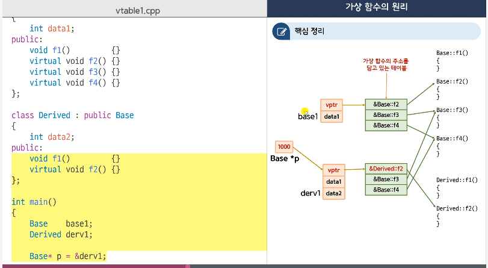
- 오버헤드 : 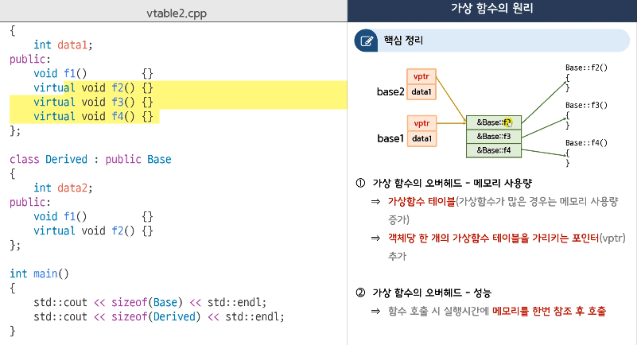
    - 메모리 사용량
    - 성능


# 21. 추상 클래스 (abstract class)
## abstract class
- 순수 가상 함수 (pure virtual function)
    - 함수의 구현부가 없고 , 선언부가 =0 으로 끝나는 가상 함수
- 추상 클래스 
    - 순수 가상 함수가 한개 이상 있는 클래스
- 추상 클래스 특징
    - 객체를 생성할수 없다.
    - 포인터 변수는 만들수 있다.
- 추상 클래스로부터 파생된 클래스
    - 기반 클래스의 순수 가상함수의 구현부를 제공하지 않으면 역시 추상 클래스이다.
- 추상 클래스의 설계 의도
    - 파생 클래스에게 특정 멤버 함수를 반드시 만들어야 한다고 지시하는 것

## 인터페이스
- 계약에 의한 설계
    - 사람과 카메라 제작자 사이에 지켜야 하는 규칙을 먼저 설계
    - 규칙은 추상 클래스를 사용해서 설계 한다.
- 규칙 
    - 모든 카메라는 ICamera로 부터 파생되어야 한다.
- 카메라 사용자
    - 규칙대로만 사용하면 된다.
- 모든 카메라 제작자
    - 반드시 규칙을 지켜야 한다.
- 설계 : 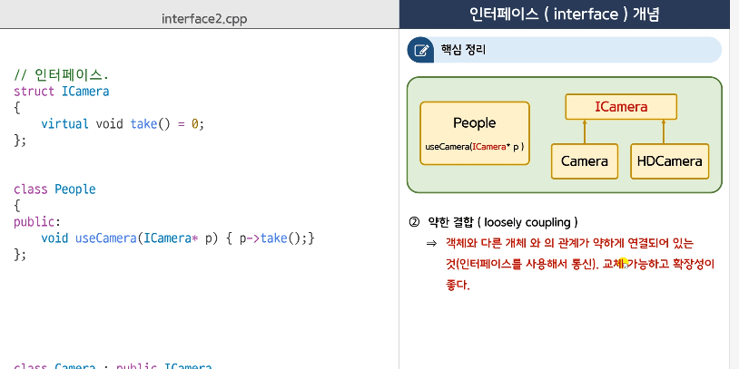


# 22. RTTI (Run Time Type Information)
## RTTI
```cpp
#include <typeinfo>
int main()
{
    int n1 = 10;
    auto n2 = n1;  // n2의 타입은 int?
    const std::type_info& t1 = typeid(n2);
    cout << t1.name() << endl;
}
```
- typeid
    - 타입에[ 대한 정보를 얻을때 사용하는 연산자
    - 다양한 형태로 사용할수 있다.
        - typeid(n1)
        - typeid(int)
        - typeid(3+4.2)
    - typeid 연산자의 결과로 const std::type_info& 가 반환된다.
        - const std::type_info& t = typeid(3+4.2);
- std::type_info
    - 타입의 정보를 담고 있는 클래스
    - 사용자가 직접 객체를 만들수 없고 , typeid()연산자를 통해서만 얻을 수 있다. (객체로는 못 얻고 , &로만 받을수 있다.)
    - 멤버 함수인 name을 통해서 타입의 이름을 얻을수 있다.
- 타입을 출력하는 것이 아니라 "조사"하고 싶다면
    - 2개의 type_info 객체를 == 연산자로 비교
- 변수 n이 int 타입인지 조사하는 일반적인 코드
    - if(typeid(n) == typeid(int))

## dynamic_cast
### 상속과 RTTI
- 함수가 인자로 기반 클래스의 포인터를 받으면
    - 기반 클래스 뿐만 아니라 모든 파생클래스를 전달 받을수 있다.
- 기반 클래스 포인터로 파생 클래스의 고유 멤버에 접근할수 없다.
    - 파생클래스의 고유 멤버에 접근하려면 파생 클래스 타입으로 캐스팅해야 한다.
- typeid
    - 가상 함수가 없는 객체 : 컴파일 시간에 포인터 타입으로 조사
    - 가상 함수가 있는 객체 : 실행시간 타입 조사 (가상함수 테이블 등을 사용)
- 가상함수가 꼭 1개 이상은 있어야 하고 , 보통 기반 클래스의 destructor를 virtual로 만들어야 한다.
- 파생클래스로 변경할때는 static_cast 가능하다.
- upcasting vs downcasting
    - upcasting : 파생 클래스 포인터를 기반 클래스 타입으로 캐스팅 (항상 안전하다.)
    - downcasting : 기반 클래스 포인터를 파생 클래스 타입으로 캐스팅하는 것 - **안전하지 않을 수도 있다.**
- downcasting 과 캐스팅 연산자
    - static_cast : 잘못된 downcasting을 조사 할수 없다. 단 , 컴파일 시간에 캐스팅을 수행하므로 오버헤드가 없다.
    - dynamic_cast : **잘못된 downcasting을 하면 0을 반환** 한다.  실행 시간에 캐스팅을 수행하므로 약간의 오버헤드가 있다.
        - non polymorphic일때는 dynamic_cast 사용할수 없다. (virtual function 1개 이상 포함)
```cpp
Dog* pDog = dynamic_cast<Dog*>(p);
if(pDog != 0)
{
    pDog->color = 1;
}
```

# 23. 다중상속
## multiple inheritance
- Diamond 상속
    - 그림 : 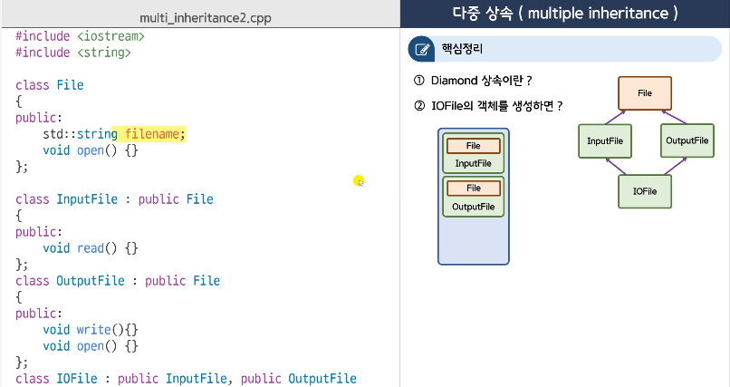
- virtual 상속을 사용하면 File의 인스턴스가 메모리에 한번만 생성되게 된다.
    - 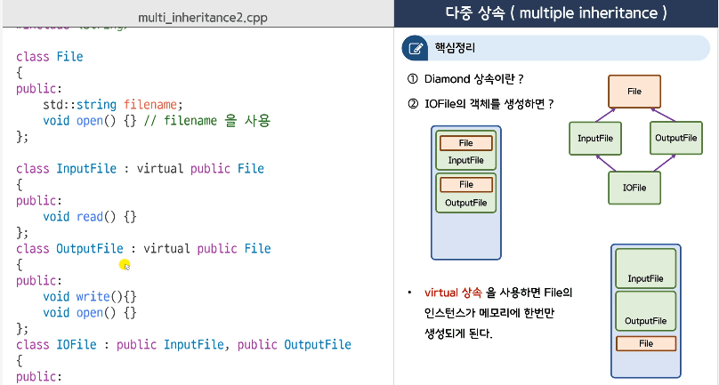
```cpp
class InputFile : virtual public File {};
class OutputFile : virtual public File {};
class IOFile : public InputFile , public OutputFile{} ;
```


# 24. Operator Overloading (연산자 재정의)
## 연산자 재정의 개념
- + , - , * 등의 연산자도 함수로 만들 수 있다. 
    - operator+ , operator- , operator*
- a+b를 컴파일러가 해석하는 방법
    - primitive type인 경우 일반적인 덧셈을 수행한다.
    - a,b중 한개라도 사용자 정의 타입이면
        - operator+ 함수를 찾음
        - 방법 1 : 멤버 함수 검색
            - a.operator+(b)
        - 방법 2 : 멤버가 아닌 일반 함수 검색
            - operator+(a,b)
- operator+ 함수를 구현하는 2가지 방법
    - + 는 이항 연산자
    - 타입의 크기가 큰 경우 call by value보다는 "const 참조" 가 좋다.
    - friend 함수로 만든다.
```cpp
class Point 
{
    friend Point operator+(const Point& p1,const Point& p2); // member 변수 접근할수 있게 하기 위해서 
}; 

Point operator+(const Point& p1,const Point& p2)
{
    Point temp;
    temp.x = p1.x + p2.x;  // private member에 접근한다고 에러가 나온다. 
    temp.y = p1.y + p2.y;
    return temp;
}
```

- 멤버 함수로 구현하는 operator+
    - 인자가 1개 여야 한다.
```cpp
class Point 
{
    // p1.operator+(p2)
    Point operator+(const Point& p)
    {
        Point temp;
        temp.x = this->x + p.x;  // private member에 접근한다고 에러가 나온다. 
        temp.y = y + p.y;
        return temp;
    }
};
```

- 멤버와 일반함수 2개를 모두 만들어주었다면
    - 멤버 함수가 우선
    - ```p1 +1```
        - 1. p1.operator+(int)
        - 2. operator+(Point,int)
    - ```1+p1```
        - 1. 1.operator+(Point)   : 만들수 없다.
        - 2. operator+(int,Point)  : 만들수 있다. 
- a+b 
    - a가 user type이면 : 멤버 함수 , 멤버 아닌 일반 함수 모두 사용가능
    - **a가 user type이 아니면 : 멤버가 아닌 일반 함수로만 만들수 있다.**
- operator+ 함수를 호출하는 방법


## 연산자 재정의 문법 주의사항
- 인자가 모두 primitive 타입인 경우는 오버로딩 할수 없다.
- 다음 연산자는 오버로딩 할수 없다.
    - ```. * :: ?: sizeof typeid static_cast dynamic_cast rinterpret_cast const_cast```
    - ```.``` : C++20 부터 오버로딩 가능
- 멤버 함수로만 오버로딩 가능한 연산자 
    - ``` = () [] -> ```


# 25. cout 과 ostream
## cout의 원리
- cout은 ostream타입이 객체 이다.
    - cout << 3;   // cout.operator<<(3) => operator<<(int)
    - cout.operator<<(3);    // 직접 부르는 방법
- ostream& operator<<(int n){ return *this; }
- 여러개를 연속적으로 출력
    - operator<< 함수에서 "자기 자신을 참조로 리턴"
- ostream과 cout은 std 이름 공간안에 있다.

## ostream 과 C++ 표준
- uni-code 출력 : wostream wcout;
    - wcout << L"hello";    // 유니코드 고려
- basic_ostream<> 클래스 템플릿


## ostream & user define type
- cout의 특징
    - cout.operator<<(int)  <<(double)등 모든 버젼을 가지고 있다. 
    - 멤버 함수 먼저 찾고 , 일반 함수를 찾는다.
- 사용자 정의 타입을 cout으로 출력할수 있게 하려면
```cpp
friend operator<<(std::ostream& os, const Point& pt);

operator<<(std::ostream& os, const Point& pt)
{
    // os.operator<<(pt.x) :이것을 호출하므로 ,위의 os argument를 const를 붙이면 에러가 발생
    os << pt.x << "," << pt.y;
    return os;
}
```


## endl 원리
- cout.put('\n);    cout.flush();
```cpp
ostream& myendl(ostream& os)
{
    os.put('\n');
    os.flush();
    return os;
}
```
- cout << endl;  // cout.operator<<(endl);
    - // cout.operator<<(함수포인터)
- endl을 함수로 만드는 이유
    - cout << "A" << tab << "B" << endl;    // tab도 만들어주면 사용할수 있다. 
    - // cout.operator<<(함수포인터)
```cpp
ostream& tab(ostream& os)
{
    os << '\t';
    return os;
}
ostream& menu(ostream& os)
{
    os << '1. sul';
    os << '2. tul';
    return os;
}

cout << "A" << tab << "B" << endl;
```


# 26. 연산자 재정의 활용
## 증가 연산자 (increment operator)
- 증가/감소 연산자 재정의가 사용되는 경우
    - C++ 표준 라이브러리인 STL의 반복자
- 증가 감사 연산자 재정의 예제를 통해서
    - 연산자 재정의 문법 뿐 아니라 다양한 내용을 배울수 있다.

- 전위형과 후위형을 구별해야 한다.
    - 후위형 만들때는 함수 인자로 int 타입을 한개 가지도록 만든다. 
        - 사용되지 않지만 전위형과 구별하기 위해
```cpp
class Point 
{
    Point operator++()   // 전위형
    {
        ++x , ++y;
        return *this;
    }
    // Point operator++(int){}   : 후위형
};

++p; // p.operator++()
p++;  // p.operator++(int)

int n=3;
++++n;  // 5

++++p; // 을 하면 2번 증가하는 것이 아니다.
    // ++(++p)
    // (p.operator++()).operator++()  으로 되므로 객체를 반환하게 됨.
    // 2번 더하게 하려면 &로 해야 한다. 
```

```cpp
class Point 
{
    Point& operator++()   // 전위형
    {
        ++x , ++y;
        return *this;
    }
    Point operator++(int)  // 후위형 : 이전 것을 저장하고 있다가 반환을 해야 한다. 
    {
        Point temp(*this);
        // ++x;
        // ++y;
        ++(*this);  // 전위형을 재사용해서 만들면 정책을 관리하는 곳을 한 곳에 놓는다.
        
        return temp;
    }
};

++p; // p.operator++()
p++;  // p.operator++(int)

++++p; // 을 하면 2번 증가한다. 
```
- 후위형은 전위형을 사용해서 구현한다.
    - 정책을 관리하는 코드는 한곳에 있는 것이 좋다.
- **일반적으로 후위형보다 전위형이 빠르다.**
- 연속적인 ++을 사용하지 못하게 하기 위해, 상수 객체를 반환하는 경우도 있다. ++++ 이 안됨
    - const Point operator++(int)


## 대입 연산자
```cpp
class Point 
{
    int x,y;
    Point(int a , int b): x(a),y(b) {}
};

Point p1(1,1); // 생성자 호출
Point p2(2,2); // 생성자 호출
Point p3(p1);  // 복사 생성자 호출
Point p4 = p1; // 복사 생성자 호출

p4 = p2;   // p4.operator=(p2)

```
- 초기화와 대입
    - 초기화 Point p1(p2) or Point p1= p2;   - 복사 생성자 호출
    - 대입 p1 = p2;    대입 연산자 호출
```cpp
Point(const Point& p) : x(p.x) , y(p.y) { }  // 디폴트 복사 생성자 (컴파일러가 자동생성)
Point& operator=(const Point& p)    // 디폴트 대입연산자 (컴파일러가 자동생성)
{
    x = p.x;
    y = p.y;
    return *this;
}
```

-대입연산자의 반환값
    - 자기 자신을 참조로 반환해야 한다. 
```cpp
class Point 
{
    int x,y;
    Point(int a , int b): x(a),y(b) {}
    Point& operator=(const Point& p)
    {
        x = p.x;
        y = p.y;
        
        return *this;
    }
};
```


## 스마트 포인터 개념
- 스마트 포인터란?
    - 객체지만 포인터처럼 동작하는 객체
```cpp
class Ptr
{
    Car* pObj;
    Ptr(Car* p = 0) : pObj(p) { }
    ~Ptr(){ delete pObj; }
    Car* operator->(){ return pObj; }
    Car& operator*(){ return *pObj; }
};

Ptr p = new Car; // Ptr p(new Car)
p->Go();   // p.operator->()Go()
        // p.operator->()->Go()   // 1000->Go()
(*p).Go() // (p.operator*()).Go()
```
    - 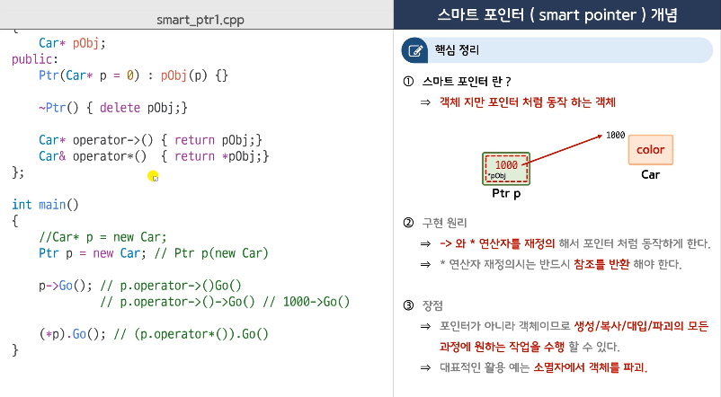

- C++ 표준 smart pointer
    - new로 할당한 메모리는 반드시 delete 로 파괴해야 한다.
- 스마트 포인터는 자동으로 자원을 관리해줌
- std::shared_ptr<>
    - C++ 표준 스맡 포인터
    - <memory> 헤더
```cpp
// std::shared_ptr<Car> p1 = new Car; // error : 복사 초기화가 안되게 explicit로 선언됨
std::shared_ptr<Car> p1(new Car);  // ok

p1->Go();
```
    
## 함수 객체 (function object)
- 함수 객체
    - 객체가 함수처럼 사용되는 경우 : ex   p(1,2);
        - a+b  // a.operator+(b)
        - a-b  // a.operator-(b)
        - a(); // a.operator()()
        - a(1,2);  // a.operator()(1.2)
        - int operator()(int a , int b) { return a+b; }
    - 함수 객체의 장점
        - 상태를 가지는 함수
        - 특정 상황에서는 일반함수보다 빠르다.

- 상태를 가지는 함수
    - 함수 객체는 () 연산자 함수 뿐 아니라 "멤버 데이터"를 가질수 있다. 
    - 생성자/소멸자/멤버 함수 등도 활용 할수 있다. 
```cpp
// 0~9 사이의 난수 얻기
int frand() { 
    return rand() % 10; 
}

class URandom
{
    char history[10];
    void reset(){
        for(int i=0;i<10;i++)
            history[i] = 0;        
    }
    URandom(){
        for(int i=0;i<10;i++)
            history[i] = 0;
        
        srand(time(0));
    }
    int operator()()
    {
        int n = -1;
        do{
            n = rand() %10;
        } while(history[n] == 1);
        history[n] = 1;
        return n;
    }
};

URandom orand;
// 서로 다른게 나오도록 하기 위해서 함수인데 상태를 저장하고 있어야 한다. 
cout << orand() << endl;
cout << orand() << endl;
cout << orand() << endl;

cout << frand() << endl;
```

## 함수 객체 (functor)
```cpp
template<typename T>
class Plus
{
    T operator()(T a, T b)
    {
        return a+b;
    }
}
```

```cpp
#include <functional>  // plus<> , minus<> , multilies<>

std::plus<double> p;
cout << p(1,1) << endl;
```
- 대부분 템플릿으로 되어있다. 


## 함수 객체 (Function Object) 용어의 의미
1. 용어가 처음 사용될때
    - () 연산자 함수를 재정의한 클래스 객체
1. 요즘
    - () 연산자 함수를 사용해서 함수처럼 호출 가능한 모든 것의 객체
    - () 연산자를 재정의한 클래스 "함수 포인터" , "멤버 함수 포인터" 등
1. 호출 가능한 객체 (callable object)
    - C++ 11이후 부터 함수 객체를 대신해서 새롭게 등장하는 용어


# 27. String 클래스
## String 만들기
```cpp
class String
{
    char* buff;
    int size;
    String(const char* s)
    {
        size = strlen(s);
        buff = new char[size+1];
        strcpy(buff , s);
    }
    ~String()
    {
        delete[] buff;
    }
    firend ostream& operator<<(ostream& os,const String& s);
};

ostream& operator<<(ostream& os,const String& s)
{
    return os << s.buff;
}

int main()
{
    String s1 = "hello";
    cout << s1 << endl;
}
```

```cpp
// 깊은 복사
class String
{
    char* buff;
    int size;
    String(const char* s)
    {
        size = strlen(s);
        buff = new char[size+1];
        strcpy(buff , s);
    }
    // 복사 생성자 : 깊은 복사
    String(const String& s) : size(s.size)
    {
        buff = new char[size+1];
        strcpy(buff,s.buff);
    }
    ~String()
    {
        delete[] buff;
    }
    firend ostream& operator<<(ostream& os,const String& s);
};

ostream& operator<<(ostream& os,const String& s)
{
    return os << s.buff;
}

int main()
{
    String s1 = "hello";
    cout << s1 << endl;
    
    Stirng s2 = s1;  // 기본 : 얕은 복사
    cout << s2 << endl;
}
```

```cpp
// 깊은 복사
class String
{
    char* buff;
    int size;
    String(const char* s)
    {
        size = strlen(s);
        buff = new char[size+1];
        strcpy(buff , s);
    }
    // 복사 생성자 : 깊은 복사
    String(const String& s) : size(s.size)
    {
        buff = new char[size+1];
        strcpy(buff,s.buff);
    }
    ~String()
    {
        delete[] buff;
    }
    // 대입 연산자
    String& operator=(const String& s)
    {
        size = s.size;
        delete[] buff;
        buff = new char[size+1];
        strcpy(buff,s.buff);
        return *this;
    }
    firend ostream& operator<<(ostream& os,const String& s);
};

ostream& operator<<(ostream& os,const String& s)
{
    return os << s.buff;
}

int main()
{
    String s1 = "hello";
    cout << s1 << endl;
    
    Stirng s2 = s1;  // 기본 : 얕은 복사
    cout << s2 << endl;
    
    String s3 = "world";
    cout << s3 << endl;
    
    s3 = s1;   // 대입 연산자  s2.operator=(s1)
    cout << s3 << endl;
}
```
- 그림 : 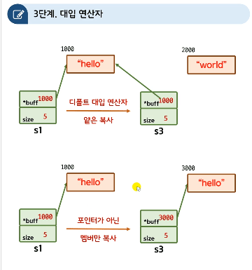

```cpp
// 깊은 복사
class String
{
    char* buff;
    int size;
    String(const char* s)
    {
        size = strlen(s);
        buff = new char[size+1];
        strcpy(buff , s);
    }
    // 복사 생성자 : 깊은 복사
    String(const String& s) : size(s.size)
    {
        buff = new char[size+1];
        strcpy(buff,s.buff);
    }
    ~String()
    {
        delete[] buff;
    }
    // 대입 연산자
    String& operator=(const String& s)
    {
        // 대입 연산자의 규칙 : 자신과의 대입을 조사해야 한다.
        if( &s == this) return *this;
        
        size = s.size;
        delete[] buff;
        buff = new char[size+1];
        strcpy(buff,s.buff);
        return *this;
    }
    firend ostream& operator<<(ostream& os,const String& s);
};

ostream& operator<<(ostream& os,const String& s)
{
    return os << s.buff;
}

int main()
{
    String s1 = "hello";

    // 자기 자신에게 넣는 것도 문제가 없어야 한다. 
    s1 = s1;   // 대입 연산자  s1.operator=(s1)
    cout << s1 << endl;
}
```
- 대입 연산자의 규칙 : 자신과의 대입을 조사해야 한다.


# 28. STL Container
- #include <list>
- standard template library (STL)
    - list , stack, queue , tree, hash 등
    - sort, binary search 등 알고리즘
    - 날짜 , 시간등..
    - thread / concurrency등
- STL 역사 : 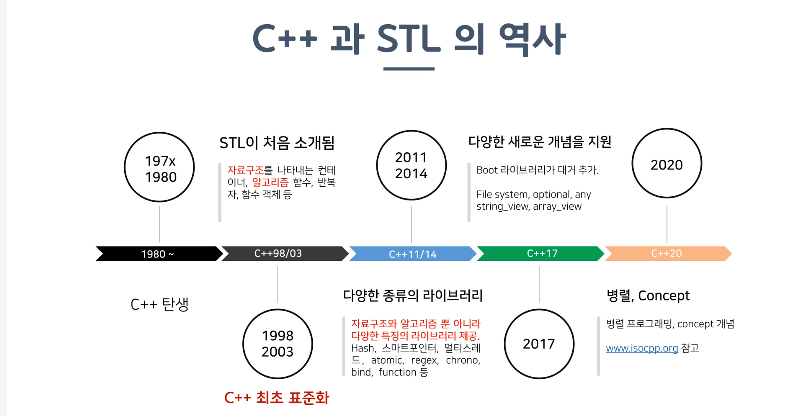
- container : 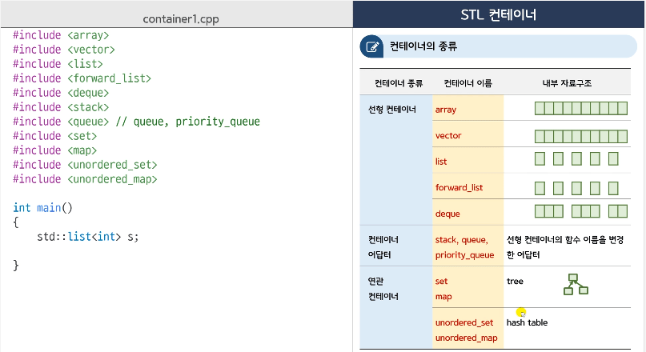
- 특징 
    - 멤버 함수 이름이 동일
    - 제거와 반환이 별도로 분리되어져있음.
- 컨테이너 생성
    - list<int> s3(10,3); // 10개를 3으로 초기화
    - list<int> s4{10,3};  // 2개의 10,3으로 초기화
- 요소 출력
    - [] 연산자 : vector , deque는 가능  , list는 안됨
    - range for 사용 for(auto& n :v)
    - iterator 사용


# 29. STL iterator
- 배열 접근 방법
    - 배열 연산자
    - 포인터 사용해서 접근
- 반복자 (iterator)
    - 포인터와 유사하게 동작하는 객체로서 반복자를 사용하면 컨테이너의 모든 요소를 순차적으로 접근 할수 있다.
- vector<int>::iterator vit = v.begin();
    - auto를 사용하는 것이 편리하다.  auto vit = v.begin();
- **일반 함수 begin(v) , end(v)를 사용하는 방법도 있다.  <- 모든 container에 쓸수 있다.**
- 컨테이너의 모든 요소를 열거하는 방법
    - 배열 연산자 [] 사용
    - std::begin(v) 사용 , std::size(v) : 모든 container 사용가능
    - range for 구문 사용 : 모든 container 사용가능


# 30. STL algorithm
- 정렬, 검색 , 순열 등
- auto p = std::find(begin(x) , end(x) , 3);
    - 검색 실패시 last    : null이 아님

## 알고리즘과 조건자(predicator)
- <algorithm>  <numeric>
- _if
- auto p = find_if (begin(v) , end(v) , foo);
- find_if (begin(v) , end(v) , [](int a){ return  n %3 ==  0;} ) ;
- replace(begin(v) , end(v) , 10 , 0);  // 10을 0으로 바꿔라.
- replace_if(begin(v) , end(v) , [](int n){ return n>= 10;} , 0);  // 10보다 큰 것을 0으로 바꿔라.
- 모든 요소의 합을 구해서 출력해주세요.
    - int sum = accumulate(begin(v) , end(v) , 0);  // 합 변수는 0부터 합쳐라.
- sort(begin(v) , end(v) ) ; // 오름 차순
- sort(begin(v) , end(v) , [](int a , int b){ return a>b; } ) ; // 내림 차순
- vector의 모든 요소를 1로 채워서 출력해보세요.
    - fill(begin(v) , end(v) , 1);

- Charles : 더 살펴 볼 것
    - algotirhm library , numeric library


# 31. 예외 처리
- 함수가 실패하면
    - throw 키워드를 사용해서 예외를 던진다.
    - 던져진 예외를 처리하지 않으면 프로그램은 종료된다.
- 예외를 처리하려면 
- catch 문을 여러개 만들수 있다.
    - catch(...) 은 모든 종류의 예외를 잡을수 있다. 
```cpp
try
{
    int ret = readFile();
    // ...
}
catch (const char* s)
{
    cout << s << endl;
}
catch (int n)
{
    
}
catch(...)
{
    
}
```

## C++ 표준 예외 클래스
- throw 1;    -> catch(int n){}    이렇게 integer 하나 던져서 뭘 어쩌라구?
- 예외 전용 클래스를 만들어서 사용하자
```cpp
class FileNotFound : public std::exception
{
    virtual const char* what() const noexcept
    {
        return "file not found";
    }
};
void foo()
{
    throw FileNotFound();
}

try {
    foo();
}
catch(FileNotFound e)
{
    
}
```
- 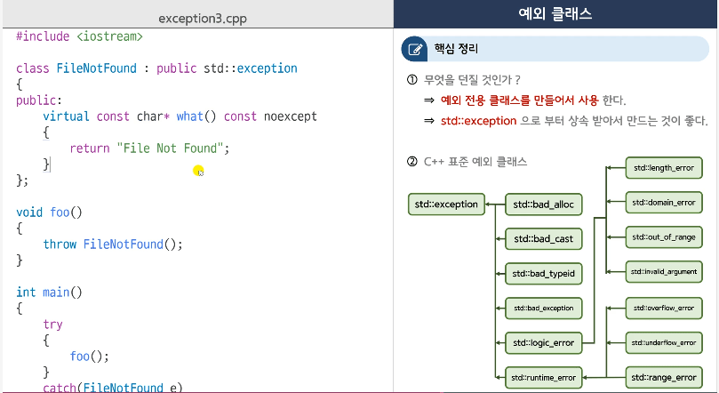


```cpp
catch(std::exception& e)
{
    cout << e.what() << endl;
}
```
- exception 을 catch 할때는 참조로 받는다. 


## noexcept
- 예외가 있는지 없는지도 표시해주면 좋다.
- C++11 이후 
    - 예외 없음.
        - void f() noexcept;
        - void f() noexcept(true);
    - 예외 있음
        - void f();
        - void f() noexcept(false);
- std::bad_alloc
    - new 연산자로 메모리를 할당할때 메모리가 부족한 경우 std::bad_alloc 예외가 던져집니다. 
- **함수가 예외가 없음을 조사하는 방법**
    - noexcept(함수 호출식);


# 32. stream
## cin
```cpp
int main()
{
    int n = 0;
    while(1)
    {
        std::cin >> n;  // 'a' 로 입력 . error
        if(std::cin.fail())
        {
            cout << "fali" << endl;
            // cin의 상태를 reset
            std::cin.clear();   // 실패를 나타내는 상태 bit를 reset
            //입력버퍼를 비운다. 
            // std::cin.ignore();   // default를 1자를 지운다.
            std::cin.ignore(256,'\n');  // \n을 만날때까지 최대 256을 비우자.
            continue;
        }
        break;
    }
    cout << n << endl;
}
```
- cin도 다양한 member 함수를 가지고 있다.


```cpp
std::getline(std::cin, s);  // 문자 입력
cout << s << endl;
```

## file stream
- ostream cout ==> basic_ostream<>
- typedef basic_ostream<char> ostream

- #include <fstream>
- 그림 : 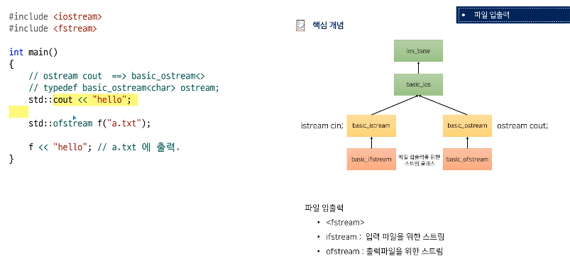

